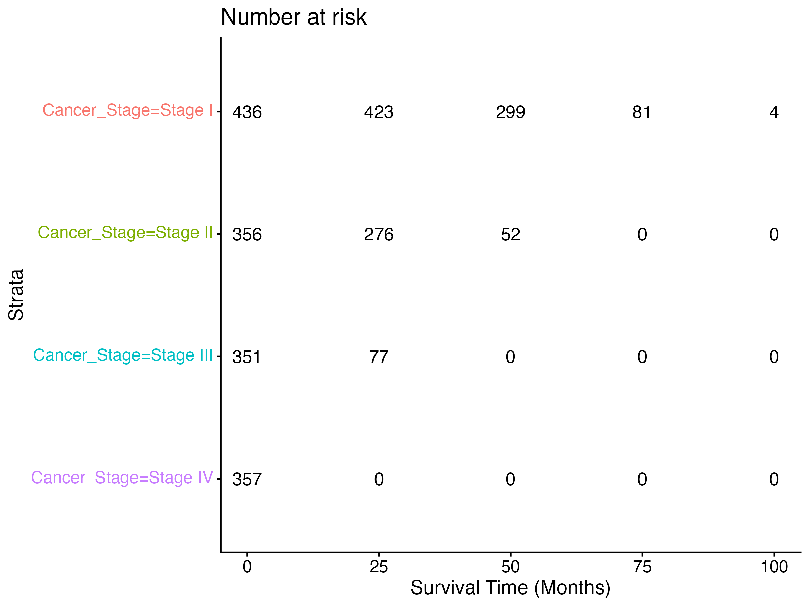

# lung-cancer-survival-analysis
Kaplan–Meier and Cox proportional hazards survival analysis of lung cancer patients by stage at diagnosis.
# Lung Cancer Survival Analysis

## Overview
This project examines the relationship between **stage at diagnosis and overall survival** in lung cancer patients. Survival outcomes were analyzed using **Kaplan–Meier survival curves** and **Cox proportional hazards regression** in R.

The goal of the analysis is to demonstrate how stage at diagnosis affects survival outcomes and to illustrate standard survival analysis methods commonly used in oncology research.

---

## Research Question
Does **cancer stage at diagnosis** significantly affect overall survival in lung cancer patients?

---

## Dataset
The dataset contains **1,500 simulated lung cancer patient records** with demographic, clinical, and survival information.

Key variables used in this analysis include:

- `Cancer_Stage` – Stage of lung cancer at diagnosis
- `Survival_Months` – Survival time in months
- `Survived` – Patient survival status
- `Age` – Age at diagnosis
- `Gender` – Patient gender

Additional clinical and lifestyle variables are also included in the dataset.

---

## Methods

### Kaplan–Meier Survival Analysis
Kaplan–Meier survival curves were generated to compare survival probabilities across cancer stage groups.

### Log-Rank Test
A log-rank test was used to determine whether survival distributions differed significantly between stages.

### Cox Proportional Hazards Model
A Cox regression model was fitted to estimate the **hazard of death** associated with cancer stage while adjusting for:

- Age
- Gender

### Model Diagnostics
The proportional hazards assumption was evaluated using the **Schoenfeld residual test**.

---

## Results
Kaplan–Meier survival curves showed substantial differences in survival probability across cancer stages. Patients diagnosed at earlier stages demonstrated higher survival probabilities over time compared to those diagnosed at later stages.

The log-rank test indicated that survival distributions differed significantly across stage groups (**p < 0.0001**).

The Cox proportional hazards model further confirmed that advanced cancer stages were associated with substantially higher hazards of death compared with Stage I disease.

---

## Example Output

Kaplan–Meier survival curve by cancer stage:

---

## Tools Used
- **R**
- `survival`
- `survminer`
- `tidyverse`
- `broom`

---

## Project Structure
