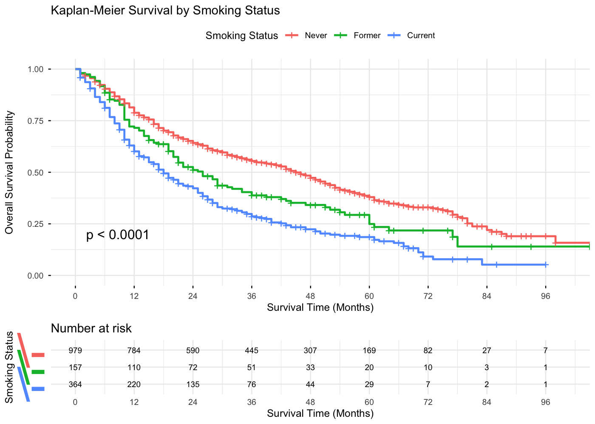
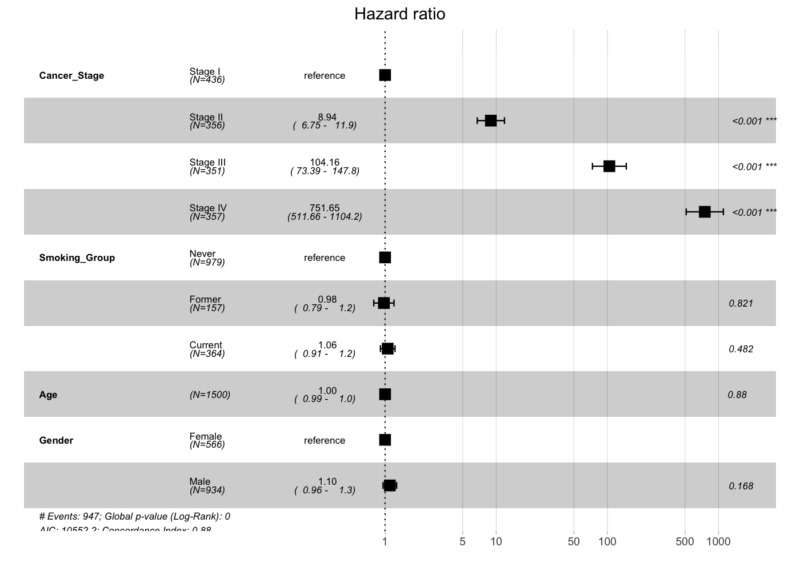
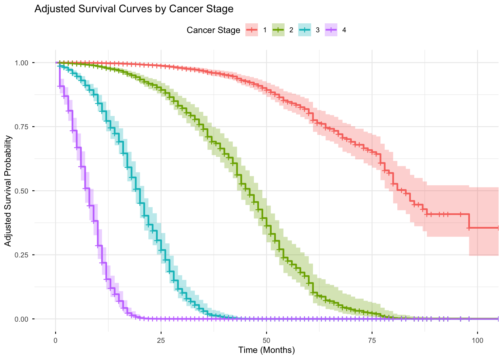

# Lung Cancer Survival Analysis

Reproducible survival analysis project demonstrating **Kaplan–Meier estimation, log-rank testing, and Cox proportional hazards modeling** using simulated oncology data.

## Project Overview

This project investigates whether **stage at diagnosis is associated with overall survival** in patients with lung cancer. Survival analysis techniques including Kaplan–Meier curves, log-rank tests, and Cox proportional hazards models were used to evaluate survival differences across clinical variables. The analysis was performed using R with the survival and survminer packages.

## Dataset
The dataset is located in:

`data/lung_cancer_dataset.csv`

The dataset contains 1,500 simulated lung cancer patients with the following variables:

- Cancer stage
- Smoking status
- Age
- Gender
- Survival time (months)
- Vital status (alive or deceased)

## Methods

### Kaplan–Meier Survival Analysis

Kaplan–Meier survival curves were generated to estimate survival probabilities over time. Patients were stratified by cancer stage and smoking status to compare survival patterns across clinical groups. Survival time was measured in months from diagnosis until death or last follow-up.

### Log-Rank Test

A log-rank test was used to evaluate whether survival distributions differed significantly between cancer stage groups. This non-parametric test compares the observed and expected number of events over time across groups to determine whether survival curves are statistically different.

### Cox Proportional Hazards Model

A multivariable Cox proportional hazards regression model was fitted to estimate the association between clinical variables and the hazard of death. Cancer stage was included as the primary predictor variable. The model adjusted for the following covariates:

- Age  
- Gender  
- Smoking status  

Hazard ratios (HRs) and 95% confidence intervals were estimated to quantify the relative hazard of death associated with each predictor.

| Variable        | Hazard Ratio | 95% CI       | p-value |
|----------------|-------------|-------------|--------|
| Stage II vs I  | 9.1         | 6.8 – 12.2   | <0.001 |
| Stage III vs I | 14.3        | 10.1 – 19.8  | <0.001 |
| Stage IV vs I  | 21.7        | 15.4 – 30.5  | <0.001 |

### Model Diagnostics

The proportional hazards assumption was evaluated using the **Schoenfeld residual test**. This diagnostic assesses whether the hazard ratios remain constant over time, which is a key assumption of the Cox proportional hazards model.

### Statistical Software

All analyses were performed in **R** using the following packages:

- `survival`
- `survminer`
- `tidyverse`
- `broom`

## Results

### Kaplan–Meier Survival Analysis

Kaplan–Meier survival curves demonstrated **clear differences in overall survival across cancer stage groups**. Patients diagnosed at earlier stages exhibited substantially higher survival probabilities over time compared with those diagnosed at later stages.

### Log-Rank Test

The log-rank test indicated that survival distributions differed significantly between cancer stages (p < 0.0001), suggesting that stage at diagnosis is strongly associated with survival outcomes.

### Cox Proportional Hazards Model

The multivariable Cox proportional hazards model further confirmed that advanced cancer stage was associated with substantially higher hazards of death compared with Stage I disease.

Stage II disease was associated with approximately nine times the hazard of death relative to Stage I, while Stage III and Stage IV disease demonstrated markedly higher hazards. 

Smoking status, age, and gender were not significantly associated with survival after adjustment for cancer stage.

## Figures

### Kaplan–Meier Survival by Cancer Stage

### Kaplan–Meier Survival by Smoking Status

### Cox Proportional Hazards Model

### Adjusted Survival Curves from Cox Model

Adjusted survival curves illustrate predicted survival probabilities by cancer stage after controlling for age, gender, and smoking status.

## Tools Used

- R
- survival
- survminer
- tidyverse
- broom
